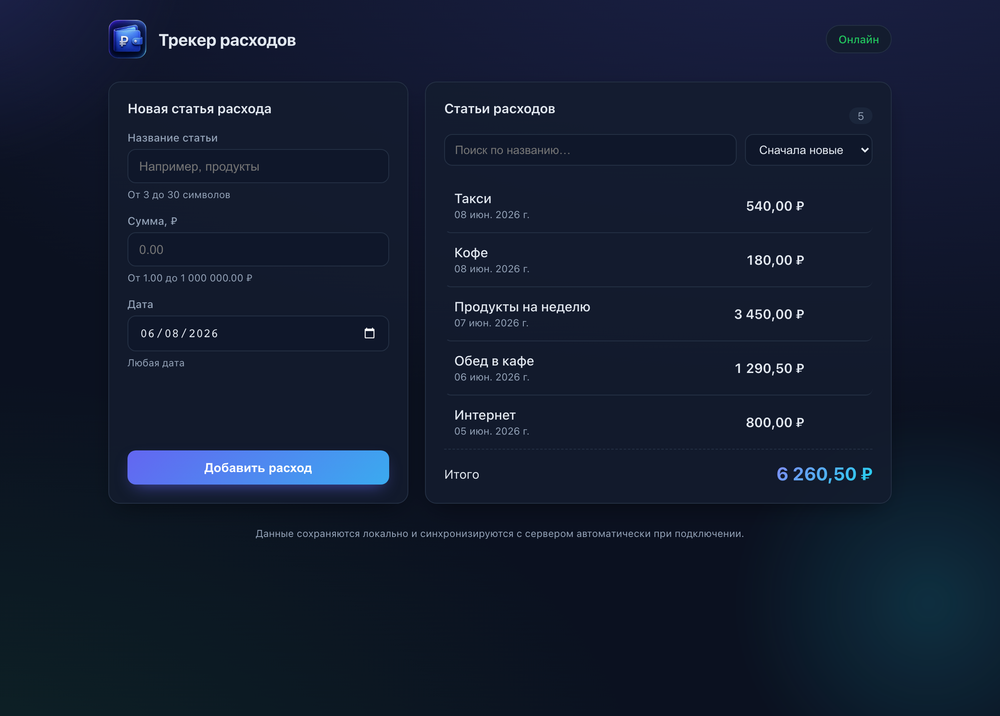
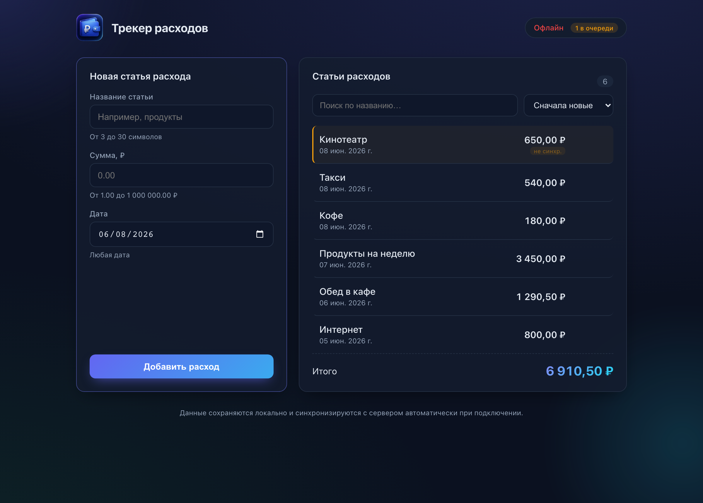
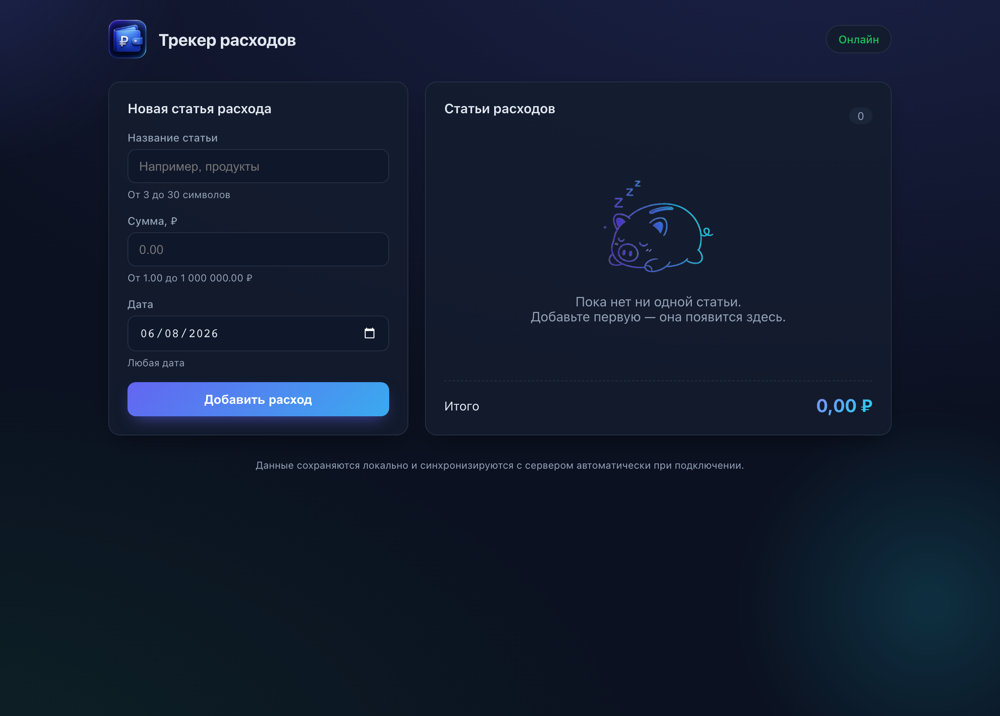
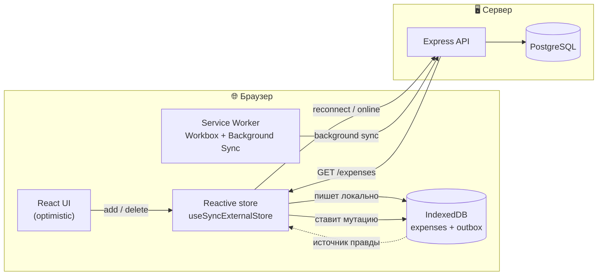

# 💸 Expense Tracker — offline-first PWA трекер расходов

[](https://github.com/Anto-MSHK/expense-tracker/actions/workflows/ci.yml)

Полноценный **offline-first PWA** трекер расходов на TypeScript: React + Vite на фронте, Node.js + Express + PostgreSQL на бэке. Статьи создаются и читаются даже без сети — изменения копятся в локальной очереди и **автоматически синхронизируются** с сервером при восстановлении соединения.

<table>
  <tr>
    <td width="50%"><p align="center"><sub>🟢 Онлайн — данные синхронизированы</sub></p></td>
    <td width="50%"><p align="center"><sub>🟠 Сервер недоступен — новая статья в очереди («не синхр.»)</sub></p></td>
  </tr>
</table>

<p align="center"><br/><sub>Пустое состояние со спящей копилкой</sub></p>

---

## ✨ Ключевые особенности

- **Local-first архитектура.** IndexedDB — источник правды для UI; сервер догоняется в фоне. Приложение мгновенно отзывчиво и работает офлайн.
- **Outbox-очередь + идемпотентный sync.** `id` генерируется на клиенте (UUID), сервер делает `upsert` — повторная отправка из очереди не плодит дубли.
- **Живой статус подключения.** Хедер различает три состояния: `Онлайн` / `Сервер недоступен` / `Офлайн` — через `online`/`offline`-события и пинг `/health`.
- **PWA с Background Sync.** Service Worker (Workbox) кеширует оболочку приложения и проигрывает очередь даже при закрытой вкладке.
- **Единый источник валидации.** zod-схемы лежат в пакете `@expense/shared` и переиспользуются фронтом и бэком — правила не дублируются и не расходятся.
- **Деньги без float-ошибок.** Все расчёты итогов — в целых минорных единицах (копейках), формат через `Intl.NumberFormat` (₽).
- **CRUD + UX-мелочи.** Создание, редактирование и удаление статей; undo при удалении, поиск по названию и сортировка списка.
- **Строгий TypeScript + тесты.** `strict`, `noUncheckedIndexedAccess`; 22 unit/integration-теста на vitest.

---

## 🧱 Стек

| Слой        | Технологии                                                        |
|-------------|-------------------------------------------------------------------|
| Frontend    | React 18, Vite 6, vite-plugin-pwa (Workbox), idb, zod             |
| Backend     | Node.js 22, Express, Drizzle ORM, postgres.js, zod                |
| База данных | PostgreSQL 16 (Docker)                                            |
| Общее       | TypeScript 5 (strict), pnpm workspaces, Vitest                    |

---

## 🚀 Быстрый старт

> Требуется **Node ≥ 20**, **pnpm** и **Docker** (для PostgreSQL).

```bash
# 1. Зависимости
pnpm install

# 2. Конфигурация окружения
cp .env.example .env          # при необходимости поправьте порт/креды

# 3. Поднять PostgreSQL и применить миграции
pnpm db:up
pnpm db:migrate

# 4. Запустить фронт и бэк одной командой
pnpm dev
```

- Фронтенд: **http://localhost:5173**
- API: **http://localhost:3001**

> Порт `5432` занят? Поменяйте `POSTGRES_PORT` и порт в `DATABASE_URL` в `.env`.

### Проверить production-сборку

```bash
pnpm build
pnpm --filter @expense/api start      # API из dist
pnpm --filter @expense/web preview    # статика + service worker
```

---

## 🏛️ Архитектура offline-first



**Поток данных при создании статьи:**

1. Статья сразу пишется в IndexedDB с флагом `pendingOp` и попадает в **outbox** — UI обновляется оптимистично.
2. Если есть сеть — мутация немедленно реплеится на сервер; иначе ждёт в очереди.
3. При восстановлении связи (`online`-событие, оживший `/health` или Background Sync) очередь проигрывается по порядку.
4. После успешной отправки флаг `pendingOp` снимается, состояние подтягивается с сервера (`GET /expenses`).

**Стратегия конфликтов:** идемпотентный `upsert` по client-generated `id`, last-write-wins по `updatedAt`. «Отравленные» операции (4xx-валидация) выбрасываются из очереди, чтобы не блокировать остальные.

---

## 🗂️ Структура проекта

```
expense-tracker/
├── packages/
│   └── shared/             # zod-схемы + типы + money-хелперы (общие)
├── apps/
│   ├── api/                # Express + Drizzle ORM
│   │   ├── src/db/         #   схема, клиент, миграции
│   │   ├── src/routes/     #   /expenses, /health
│   │   └── src/middleware/ #   валидация, обработка ошибок
│   └── web/                # React + Vite + PWA
│       ├── src/lib/        #   idb, api, sync-движок, store
│       ├── src/hooks/      #   useConnection, useExpenses
│       └── src/components/ #   Header, форма, список
├── docker-compose.yml      # PostgreSQL
└── .env.example
```

---

## 🔌 API

Конфигурация — через **environment variables** (`DATABASE_URL`, `API_PORT`, `CORS_ORIGIN`).

| Метод    | Путь             | Описание                                              |
|----------|------------------|-------------------------------------------------------|
| `GET`    | `/health`        | Статус сервера + проверка БД (для индикатора сети)     |
| `GET`    | `/expenses`      | Список статей + итоговая сумма (`{ items, total, count }`) |
| `POST`   | `/expenses`      | Создание (идемпотентный upsert по `id`)               |
| `DELETE` | `/expenses/:id`  | Удаление (идемпотентно)                               |

Таблица `expenses`: `id` (uuid, PK), `name`, `sum` (`numeric(12,2)`), `date`, `created_at`, `updated_at`.

---

## 🧪 Тесты

```bash
pnpm test                          # unit/integration во всех пакетах
pnpm typecheck                     # строгая типизация
pnpm lint                          # Biome
pnpm --filter @expense/web test:e2e  # E2E offline-сценарий (нужны запущенные API+БД)
```

- `shared` — валидация ограничений ТЗ (длина названия, диапазон суммы, точность денег).
- `api` — валидация и роутинг (supertest, без обращения к БД).
- `web` — движок синхронизации на `fake-indexeddb`: реплей очереди, обработка сетевых/4xx-ошибок, реконсиляция с сервером.
- **E2E** (Playwright) — сквозной offline-first сценарий: online-создание → потеря сети → offline-очередь → возврат сети → автосинхронизация.

Всё это гоняется в **CI** (GitHub Actions) на каждый push/PR: линт, типизация, тесты, сборка + E2E с реальным PostgreSQL.

---

## 📋 Соответствие требованиям ТЗ

<details>
<summary>Развернуть чек-лист</summary>

**Backend**
- [x] Node.js + Express
- [x] Подключение к PostgreSQL, конфигурация через env vars
- [x] Таблица статей: `id`, `name`, `sum`, `date` (+ `created_at`/`updated_at`)
- [x] ORM (Drizzle)

**Frontend**
- [x] React + Vite
- [x] Хедер со статусом подключения и живым апдейтом
- [x] Форма с валидацией: название `3 ≤ x ≤ 30`, сумма `1.00 ≤ x ≤ 1 000 000.00`, любая дата
- [x] Список статей рядом с формой + итоговая сумма
- [x] **Бонус:** корректный расчёт суммы в рублях (в копейках, без float-ошибок)
- [x] **Бонус:** удаление статей (+ undo «Отменить»)
- [x] **Бонус:** редактирование статей (в ТЗ — необязательно)
- [x] **Сверх ТЗ:** поиск по названию и сортировка списка
- [x] Offline-first: локальное сохранение + автосинхронизация при восстановлении сети

</details>

---

## 🧭 Принятые решения

- **IndexedDB вместо localStorage** — структурированное хранилище с индексами и транзакциями; единственный разумный выбор для очереди мутаций.
- **Client-generated UUID + upsert** — даёт стабильные id офлайн и делает синхронизацию идемпотентной без серверного сопоставления.
- **Своя реактивная обёртка (`useSyncExternalStore`)** вместо тяжёлой стейт-библиотеки — IndexedDB и так источник правды, оставлять синхронизацию данных «зеркалу» в памяти ни к чему.
- **pnpm-монорепо c пакетом `shared`** — единственный способ гарантировать, что фронт и бэк валидируют данные одинаково.

## 📄 Лицензия

MIT
